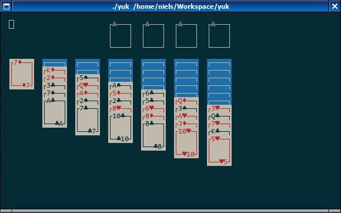

# yuk

A quick and dirty implementation of Yukon in C using ncurses.



## Usage

Compile and run:
```
gcc -o yuk -lncurses yuk.c
./yuk
```

Disable colors:
```
./yuk -m
```

The card theme can be changed in `config.h`.

Move the cursor using <kbd>H</kbd>, <kbd>J</kbd>, <kbd>K</kbd>, and <kbd>L</kbd> or the arrow keys.

Select the card under the cursor using <kbd>SPACE</kbd>.

Move the selected card to the tableau or foundaton under the cursor using <kbd>M</kbd>.

Press <kbd>A</kbd> to automatically move a card (from any tableau) to a foundation if possible.

Press <kbd>Q</kbd> to quit.
